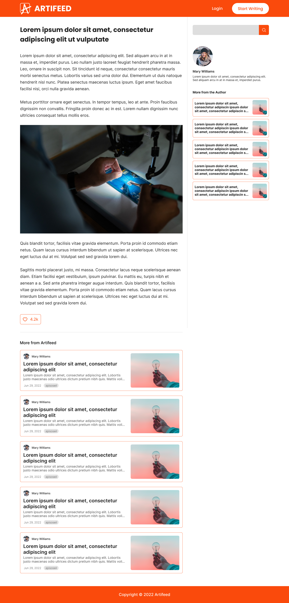

# Artifeed: Article Publishing Platform

This web application helps you publish your blogs and articles, and was developed using React.js, Node.js and MySQL.

## Website interface

### Homepage


### Article Editor


### Article Reader



### Account Registration


## Getting Started

These instructions will get you a copy of the project up and running on your local machine for development and testing purposes.

### Prerequisites

What things you need to install for running this application

```
Node.js
MySQL
Node.js package manager (npm)
```

### Installing & getting started

Clone this project and open with Visual Studio Code (preferred) or any text editor

```
git clone https://github.com/dipudl/artifeed.git
```

Go to 'backend' folder and install the required Node.js dependencies
(using npm package manager for example)

```
npm i
```

Start the node.js server (currently at port 8000)

```
node server.js
```

Go to 'frontend' folder and install all required Node.js dependencies
(using npm package manager for example)

```
npm i
```

Start React.js frontend application

```
npm start
```

## Built With

* [Node.js](https://nodejs.org/en/) - For programming this server
* [React.js](https://react.dev/) - Frontend web development library
* [npm](https://www.npmjs.com/) - Package Manager

## Contributing

All the helpful pull requests will be accepted.

## License

This project is licensed under the MIT License - see the [LICENSE](LICENSE) file for details